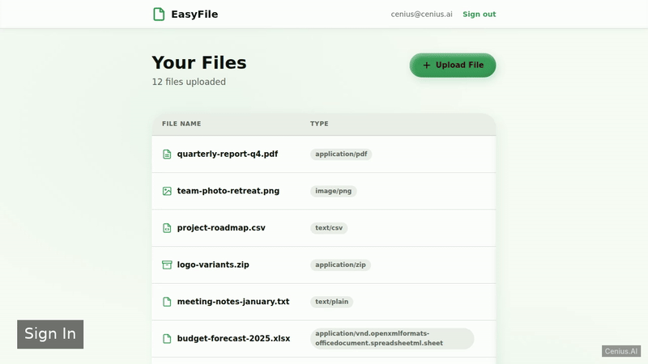
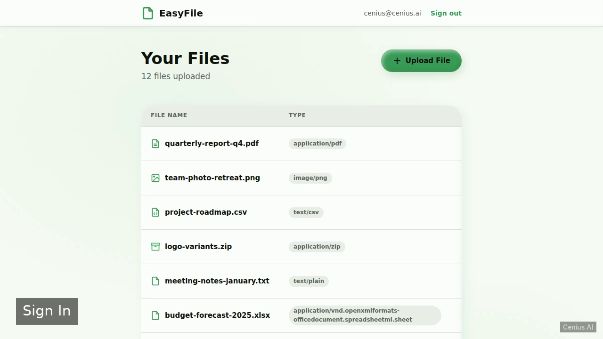
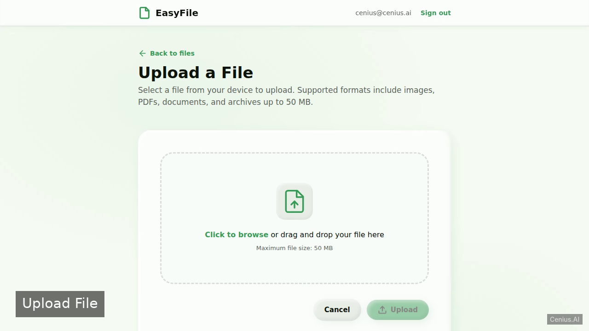

# EasyFile — Elixir/Phoenix web application reference implementation

**EasyFile** is a free, open-source web application written in Elixir/Phoenix. A Phoenix web application where authenticated users can upload files to local storage and view a list of their uploaded files with name and size. Every EasyFile file — code, design, seeded demo data — ships in this repository under the Apache-2.0 license. Self-host it, or [remix EasyFile on cenius.ai](https://cenius.ai/marketplace/p/easyfile?ref=gh&utm_campaign=easyfile-phoenix) to get a custom build with full rebrand rights.


[](LICENSE)  [](https://cenius.ai)

[](https://cenius.ai/marketplace/p/easyfile?ref=gh&utm_campaign=easyfile-phoenix)

> **▶ [Open & edit in cenius.ai](https://cenius.ai/marketplace/p/easyfile?ref=gh&utm_campaign=easyfile-phoenix)** — one click to an editable workspace: describe changes in plain English, get an instant preview, one-click deploy and host. Modifications made on the platform come with full rebrand & relicense rights.

_Local clone? See [Quick start](#quick-start) below. cenius.ai is the zero-setup path._

## Demo




📽 **[Watch the walkthrough](https://cenius.ai/marketplace/p/easyfile?ref=gh&utm_campaign=easyfile-phoenix)** — plays on cenius.ai · [MP4 file](.github/media/demo.mp4)

## Screenshots

  

## Quick start

```bash
./install.sh   # installs dependencies + seeds demo data
```

See [`INSTALL.md`](INSTALL.md) for full setup and usage instructions.

## Architecture

Open the repo and you'll find a complete Elixir/Phoenix application (125 files). Top-level layout: `config/`, `lib/`, `priv/`, `test/`. Run `./install.sh` once to install packages and populate demo data — the app is ready to use immediately after. Full setup details: [`INSTALL.md`](INSTALL.md).

## Features

- File Upload
- File List

## Usage guide

### Starting the Application

Run the development server:

```sh
mix phx.server
```

### Web Interface

1. Open `http://localhost:4000` in your browser. You will see the sign‑in page (rendered by `session_html/new.html.heex`).
2. Sign in with the demo user credentials. The exact email and password are defined in `priv/repo/seeds.exs`. After successful authentication you are redirected to the file list.
3. The file list page (`file_html/index.html.heex`) displays all your uploaded files, showing their name and size.
4. To upload a new file, navigate to the upload page (rendered by `file_html/new.html.heex`). Select a file and submit the form.
5. After uploading, you are returned to the file list where the new file appears.

_Full guide: [`USAGE.md`](USAGE.md)_

## FAQ

### How do I get EasyFile running locally?

Pull the repo, run `./install.sh`, and you are up — the script installs packages and pre-seeds the database. [`INSTALL.md`](INSTALL.md) covers any platform-specific tweaks.

### Which framework or language does EasyFile use?

Powered by Elixir/Phoenix. This repo is the real thing — full source, seed data, and all — ready to clone and start up. Highlights include file Upload.

### Is there a no-code way to modify EasyFile?

[cenius.ai](https://cenius.ai/marketplace/p/easyfile?ref=gh&utm_campaign=easyfile-phoenix) handles the implementation. Tell it what you want in everyday words, pick up the updated build. No coding needed.

### Is white-labeling EasyFile allowed?

Yes — and the easiest way is [remixing it on cenius.ai](https://cenius.ai/marketplace/p/easyfile?ref=gh&utm_campaign=easyfile-phoenix): modifications made on the platform come with full rebrand and relicense rights over your derivative.

### Does the EasyFile license allow commercial use?

Yes — it ships under the Apache-2.0 license, which permits commercial use, modification and redistribution. The full text is in [LICENSE](LICENSE).

## License & rebranding

Released under the [Apache License 2.0](LICENSE) (© 2026 Cenius AI) — free for personal and commercial use. The Cenius name/logo are trademarks (see NOTICE).

**Need a customized version?** [Remix this app on cenius.ai](https://cenius.ai/marketplace/p/easyfile?ref=gh&utm_campaign=easyfile-phoenix) — modifications made on the platform come with **full rebrand & relicense rights** over your derivative.

## Built with cenius.ai

This entire application — code, design, seeded demo data — was generated on **[cenius.ai](https://cenius.ai)** from a plain-English description.

- 🚀 [Build your own app on cenius.ai](https://cenius.ai)
- 🎛️ [Remix EasyFile on the marketplace](https://cenius.ai/marketplace/p/easyfile?ref=gh&utm_campaign=easyfile-phoenix) — open it in a workspace, prompt for changes, and ship your own version.

More open-source apps: [the Cenius-ai catalog](https://github.com/Cenius-ai) · [showcase index](https://github.com/Cenius-ai/showcase)
